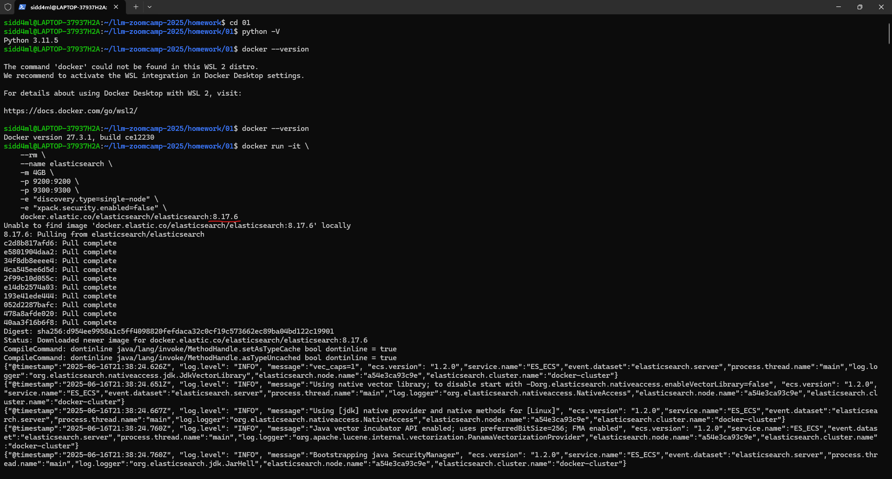
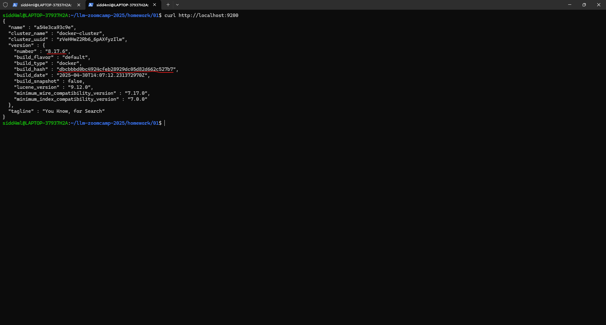

## Homework: Introduction

In this homework, we'll learn more about search and use Elastic Search for practice. 

> It's possible that your answers won't match exactly. If it's the case, select the closest one.


## Q1. Running Elastic 

Run Elastic Search 8.17.6, and get the cluster information. If you run it on localhost, this is how you do it:

 |                                                  |                                                        |
 |--------------------------------------------------|--------------------------------------------------------|
 |       |     | 


```bash
curl localhost:9200
```

   


What's the `version.build_hash` value?

#### `A: dbcbbbd0bc4924cfeb28929dc05d82d662c527b7`

## Getting the data

Now let's get the FAQ data. You can run this snippet:

```python
import requests 

docs_url = 'https://github.com/DataTalksClub/llm-zoomcamp/blob/main/01-intro/documents.json?raw=1'
docs_response = requests.get(docs_url)
documents_raw = docs_response.json()

documents = []

for course in documents_raw:
    course_name = course['course']

    for doc in course['documents']:
        doc['course'] = course_name
        documents.append(doc)
```

Note that you need to have the `requests` library:

```bash
pip install requests
```

## Q2. Indexing the data

Index the data in the same way as was shown in the course videos. Make the `course` field a keyword and the rest should be text. 

Don't forget to install the ElasticSearch client for Python:

```bash
pip install elasticsearch
```

Which function do you use for adding your data to elastic?

* `insert`
* `index`
* `put`
* `add`

###  `A: index`

## Q3. Searching

Now let's search in our index. 

We will execute a query "How do execute a command on a Kubernetes pod?". 

Use only `question` and `text` fields and give `question` a boost of 4, and use `"type": "best_fields"`.

What's the score for the top ranking result?

* 84.50
* 64.50
* 44.50
* 24.50

Look at the `_score` field.

###  `A: 44.50`

## Q4. Filtering

Now ask a different question: "How do copy a file to a Docker container?".

This time we are only interested in questions from `machine-learning-zoomcamp`.

Return 3 results. What's the 3rd question returned by the search engine?

* How do I debug a docker container?
* How do I copy files from a different folder into docker container’s working directory?
* How do Lambda container images work?
* How can I annotate a graph?

###  `A: How do I copy files from a different folder into docker container’s working directory?`

## Q5. Building a prompt

Now we're ready to build a prompt to send to an LLM. 

Take the records returned from Elasticsearch in Q4 and use this template to build the context. Separate context entries by two linebreaks (`\n\n`)
```python
context_template = """
Q: {question}
A: {text}
""".strip()
```

Now use the context you just created along with the "How do copy a file to a Docker container?" question 
to construct a prompt using the template below:

```
prompt_template = """
You're a course teaching assistant. Answer the QUESTION based on the CONTEXT from the FAQ database.
Use only the facts from the CONTEXT when answering the QUESTION.

QUESTION: {question}

CONTEXT:
{context}
""".strip()
```

What's the length of the resulting prompt? (use the `len` function)

* 946
* 1446
* 1946
* 2446

###  `A: 1446`

## Q6. Tokens

When we use the OpenAI Platform, we're charged by the number of 
tokens we send in our prompt and receive in the response.

The OpenAI python package uses `tiktoken` for tokenization:

```bash
pip install tiktoken
```

Let's calculate the number of tokens in our query: 

```python
encoding = tiktoken.encoding_for_model("gpt-4o")
```

Use the `encode` function. How many tokens does our prompt have?

* 120
* 220
* 320
* 420

Note: to decode back a token into a word, you can use the `decode_single_token_bytes` function:

```python
encoding.decode_single_token_bytes(63842)
```

###  `A: 320`

## Bonus: generating the answer (ungraded)

Let's send the prompt to OpenAI. What's the response?  

    Based on the context provided, to copy a file to a Docker container, you can use the `docker cp` command. 

    The basic syntax is as follows: 
    docker cp /path/to/local/file_or_directory container_id:/path/in/container

    So, to copy a file to a Docker container, you would:

    1. First, ensure you know the container id of the running container where you want to copy the file. You can find the container id using `docker ps`.
    2. Then use the `docker cp` command to copy the file from your local machine to the Docker container, using the following syntax: 
    docker cp /path/to/local/file container_id:/path/in/container

    Replace `/path/to/local/file` with the path to the file you want to copy, and `container_id` with the id of the container, and `/path/in/container` with the desired path in the container where you want to copy the file.