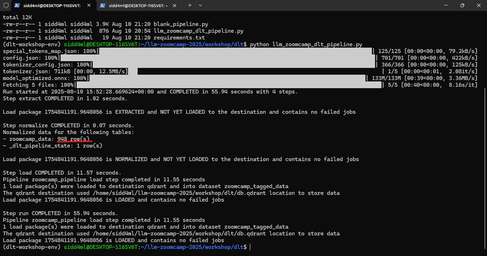
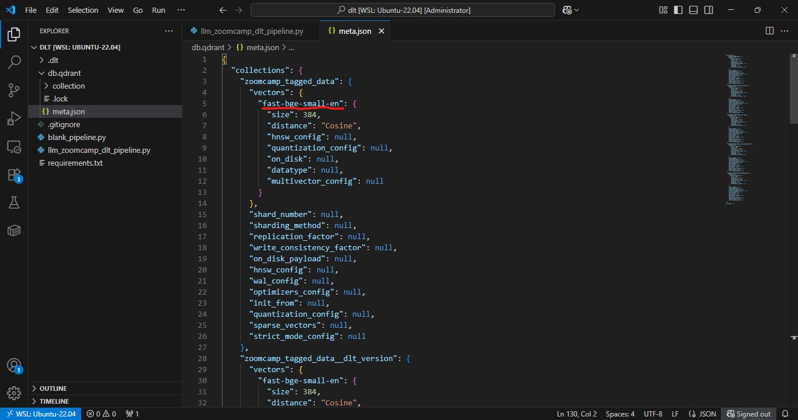

# From REST to reasoning: ingest, index, and query with dlt and Cognee

* Video: https://www.youtube.com/watch?v=MNt_KK32gys
* Homework solution: TBA

# Resources

* [Slides](https://docs.google.com/presentation/d/1oHQilxEVqGGW4S2ctNEE0wHY2LgcjYLaRUziAoinsis/edit?usp=sharing)
* [Colab Notebook](https://colab.research.google.com/drive/1vBA9OIGChcKjjg8r5hHduR0v3A5D6rmH?usp=sharing) 

--- 

# Homework

## Question 1. dlt Version

In this homework, we will load the data from our FAQ to Qdrant

Let's install dlt with Qdrant support and Qdrant client:

```bash
pip install -q "dlt[qdrant]" "qdrant-client[fastembed]"
```

What's the version of dlt that you installed?

### Answer: __1.15.0__

 |                                         |                                      |
 |-----------------------------------------|--------------------------------------|
 |      |      |


## dlt Resourse

For reading the FAQ data, we have this helper function:

```python
def zoomcamp_data():
    docs_url = 'https://github.com/alexeygrigorev/llm-rag-workshop/raw/main/notebooks/documents.json'
    docs_response = requests.get(docs_url)
    documents_raw = docs_response.json()

    for course in documents_raw:
        course_name = course['course']

        for doc in course['documents']:
            doc['course'] = course_name
            yield doc
```

Annotate it with `@dlt.resource`. We will use it when creating
a dlt pipeline.

## Question 2. dlt pipeline

Now let's create a pipeline. 

We need to define a destination for that. Let's use the `qdrant` one:

```python
from dlt.destinations import qdrant

qdrant_destination = qdrant(
  qd_path="db.qdrant", 
)
```

In this case, we tell dlt (and Qdrant) to create a folder with
our data, and the name for it will be `db.qdrant`

Let's run it:

```python
pipeline = dlt.pipeline(
    pipeline_name="zoomcamp_pipeline",
    destination=qdrant_destination,
    dataset_name="zoomcamp_tagged_data"

)
load_info = pipeline.run(zoomcamp_data())
print(pipeline.last_trace)
```

How many rows were inserted into the `zoomcamp_data` collection?

Look for `"Normalized data for the following tables:"` in the trace output.

### Answer : __948__



## Question 3. Embeddings

When inserting the data, an embedding model was used. Which one?

You can find this out by inspecting the `meta.json` file created
in the target folder. During the data insertion process, a folder named db.qdrant will be created, and the meta.json file will be located inside this folder.

### Answer: __fast-bge-small-en__

